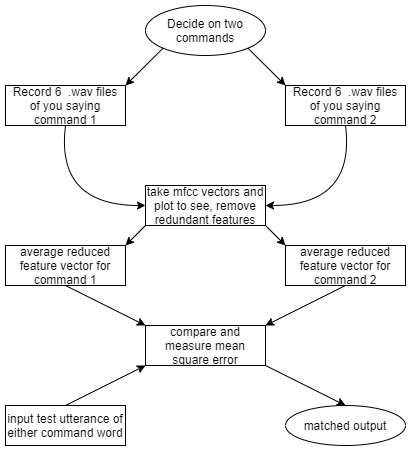

# Voice-actuation-for-projects-without-ML

This is an ML-less voice actuation mechanism for IoT and other low memory applications. Uses less starting data and provides satisfactory command actuation for low number of command words (around 2 to 4). When an actuation in a project needs a command word through speech, there is no need for a full on speech recognition model as that would be clunky and take up too much memory. Needless to mention the amount of speech data and time needed to train such a model. alternatively, like we have done here, we can just use around 5 seconds of data per command word to get an handle on how a single user says it, and then identify the same in a later utterance.
***

### Outline

Here we use the concept of MFCC-based feature vector, recorded 6 times for each word so as to grasp how the single user says it in different ways. After extracting the feature vectors 6 times for both command words (or more), we plot them to see which features actually vary the most for each word. We create a filter to discard the redundant features and save the averages for each command word. We apply the same filter on new data and then compare the new features to both the recorded features to classify the command.

***

### Contents in repository

1. audio:
    * contains self-recorded data for two command words.
    * open and close are uttered six times each.
    * total of less than 6 seconds per word.
    * Used to extract the feature vectors in 'pickles' folder.

2. pickles:
    * contains three pickled objects.
    * 'openfvs' and 'closefvs' contain the 6 feature vectors for open and close.
    * the vectors here have their first element removed beforehand.
    * the 'averages' pcikle contains the reduced and averaged vector for the commands.

3. scripts:
    * record.py contains the function to record speech and save as array of time varying data.
    * average.py is used to take the vectors stored in 'openfvs' and 'closefvs' to make 'averages' pickle.
    * testsound.py can be used to give new data and test how the vectors perform.

### License
This software is licensed under terms of [MIT License](LICENSE.md).